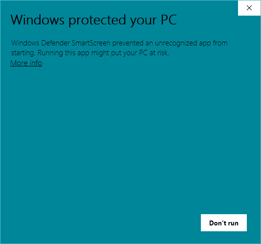

Frenchar is a Windows utility written in [AutoHotkey](https://autohotkey.com/). It helps you input special French characters faster and easier.

## Feature ##
While typing, Frenchar makes auto replacements for you, so that you can "type out" special French characters (French accents and French ligature) using regular QWERTY keyboards.

Comparing to other solutions, Frenchar has the following advantages:
- Configuration-free:  
No need to set up extra keyboard layouts. Simply run Frenchar and start typing French characters right away.

- Easy-to-use:  
No cumbersome input procedures. The replacement rules are also very intuitive.

- Non-interruptive:  
Frenchar provides a streamlined input experience.

- Portable:  
Frenchar does not require installation. Frenchar also does not write to the Windows registry or any folders.

## Quick Reference ##
L'accent aigu (é)

| Type  | Get |
| :---- | :-- |
| `e//` | `é` |

L'accent grave (à, è, ù)

| Type  | Get |
| :---- | :-- |
| `a\\` | `à` |
| `e\\` | `è` |
| `u\\` | `ù` |

L'accent circonflexe (â, ê, î, ô, û)

| Type           | Get |
| :------------- | :-- |
| `a^^` or `a66` | `â` |
| `e^^` or `e66` | `ê` |
| `i^^` or `i66` | `î` |
| `o^^` or `o66` | `ô` |
| `u^^` or `u66` | `û` |

Le tréma (ë, ï, ü)

| Type           | Get |
| :------------- | :-- |
| `e::` or `e;;` | `ë` |
| `i::` or `i;;` | `ï` |
| `u::` or `u;;` | `ü` |

La cédille (ç)

| Type  | Get |
| :---- | :-- |
| `c,,` | `ç` |

Le e dans l'o (œ)

| Type   | Get |
| :----- | :-- |
| `oe--` | `œ` |

## Download ##
You can download the compiled standalone executable `Frenchar.exe` [here](https://github.com/chaohershi/frenchar/releases). No installation required.

Alternatively, you can download the source code and run the script `Frenchar.ahk` having AutoHotkey installed.

**Please be aware that you may get a popup message from Windows SmartScreen when running the executable.** The message would state that "Windows Defender SmartScreen prevented an unrecognized app from starting." This is totally normal. It takes some time for a new certificate, like the one that Frenchar is using, to get recognized. Nevertheless, Frenchar is free and minimal and contains no malware of any kind. Feel free to do a virus scan if you are worried!

To run Frenchar from Windows SmartScreen, click on the "More info" link and then click on the "Run anyway" button.  

## License ##
Frenchar is available under the MIT License.  
Frenchar icon made by [Freepik](https://www.flaticon.com/authors/freepik) from [Flaticon](https://www.flaticon.com/free-icon/france_299490) is licensed by [CC 3.0 BY](https://creativecommons.org/licenses/by/3.0/).
